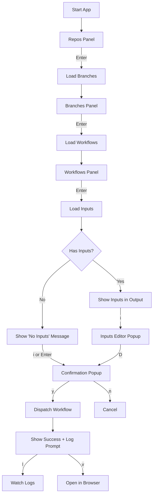
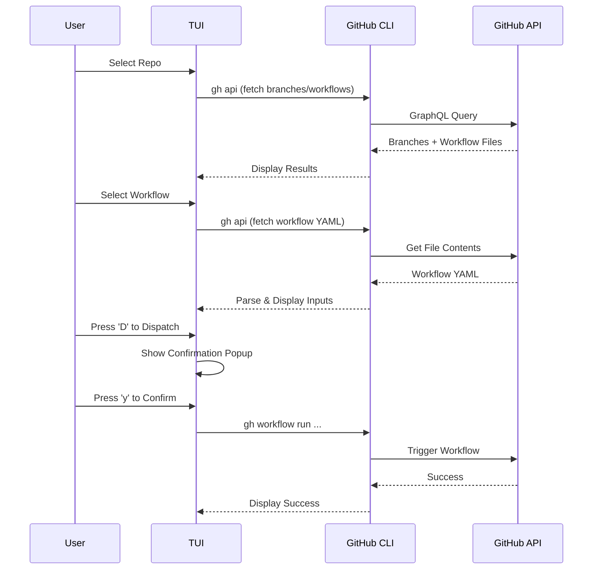
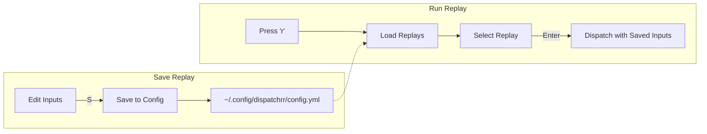
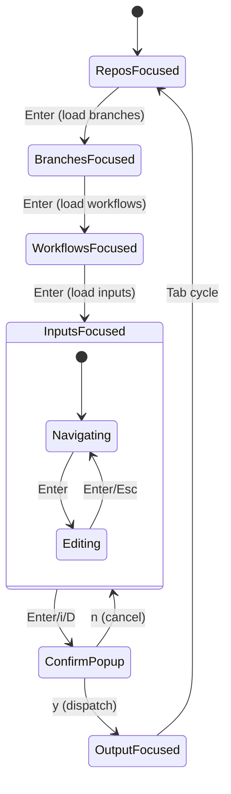

# Lazy-Dispatchrr 🚀

A beautiful terminal user interface (TUI) for dispatching GitHub Actions workflows with ease.


## Features

- 🎯 **Quick Dispatch** — Select repo → branch → workflow → dispatch in seconds
- 🔍 **Fuzzy Search** — Press `/` to filter repos, branches, or workflows instantly
- 💾 **Replays** — Save workflow input presets and replay them with one keypress
- 📋 **Input Support** — Full support for all GitHub workflow input types (string, number, boolean, choice, environment)
- ✅ **Confirmation Popup** — Preview the exact `gh` command before execution
- 📺 **Live Logs** — Watch workflow run logs directly in the terminal
- 🌐 **Browser Integration** — Open runs in GitHub with a single keypress
- **Repo Name Scrolling** — Scroll horizontally for long repo names
- **Scrollable Output** — Scroll output when logs are long

## Prerequisites

- [GitHub CLI (`gh`)](https://cli.github.com/) installed and authenticated
- Rust 2024 edition (for building from source)

## Installation

```bash
# Clone the repository
git clone https://github.com/pr0methevs/lazy-dispatchr-rs.git
cd lazy-dispatchr-rs

# Build and run
cargo build --release
./target/release/lazy-dispatchr
```

## Usage

```bash
cargo run
# or after building:
./target/release/lazy-dispatchr
```

## Keybindings

| Key | Action |
|-----|--------|
| `j` / `↓` | Move down |
| `k` / `↑` | Move up |
| `h` / `l` / `Left` / `Right` | Scroll repo names (Repos panel) |
| `Enter` | Select / Confirm |
| `Tab` | Cycle focus panels |
| `Shift+Tab` | Cycle focus (reverse) |
| `/` | Fuzzy search in current panel |
| `Esc` | Cancel / Close popup |
| `q` | Quit |
| `?` | Show help |

### Workflow Actions

| Key | Action |
|-----|--------|
| `i` | Open inputs editor (or dispatch if no inputs) |
| `D` | Dispatch workflow (with confirmation) |
| `S` | Save current inputs as a replay |
| `r` | Open replays for selected repo |
| `d` | Delete selected replay |
| `l` | Watch workflow run logs |
| `v` | Open repo/run in browser |
| `a` | Add a new repository |

### In Inputs Editor

| Key | Action |
|-----|--------|
| `j` / `k` | Navigate inputs |
| `Enter` | Edit selected input |
| `Tab` | Cycle choice options forward |
| `Shift+Tab` | Cycle choice options backward |
| `D` | Dispatch workflow |
| `S` | Save as replay |
| `Esc` | Exit editing / Close popup |

### Output Panel

| Key | Action |
|-----|--------|
| `j` / `k` / `Up` / `Down` | Scroll output (when Output panel is focused) |

## Application Flow

### Main Navigation Flow



### Workflow Dispatch Process



### Replay System Flow



### State Management



## Configuration

Configuration is stored at:
- **Linux/macOS**: `~/.config/dispatchrr/config.yml`
- **Windows**: `%LOCALAPPDATA%\dispatchrr\config.yml`

### Example Config

```yaml
repos:
  - name: owner/repo-name
    replays:
      - workflow: deploy.yml
        description: env=production, version=1.0.0
        inputs:
          - name: env
            value: production
          - name: version
            value: 1.0.0
```

## Project Structure

```
src/
├── main.rs        # Entry point
├── app.rs         # Application state & business logic  
├── event.rs       # Keyboard event handling
├── ui.rs          # TUI rendering (ratatui)
├── config.rs      # YAML config persistence
├── domain.rs      # Domain models (Repo, Workflow, InputField)
└── service/
    └── github.rs  # GitHub CLI integration
```

## Tech Stack

- **[Ratatui](https://ratatui.rs/)** — Terminal UI framework
- **[Crossterm](https://github.com/crossterm-rs/crossterm)** — Cross-platform terminal manipulation
- **[GitHub CLI](https://cli.github.com/)** — GitHub API interaction
- **[Serde](https://serde.rs/)** — Serialization/deserialization
- **[Fuzzy Matcher](https://github.com/lotabout/fuzzy-matcher)** — Fuzzy search implementation

## License

GPL-3.0

## Author

Artur Kaminski <artxk92@gmail.com>
