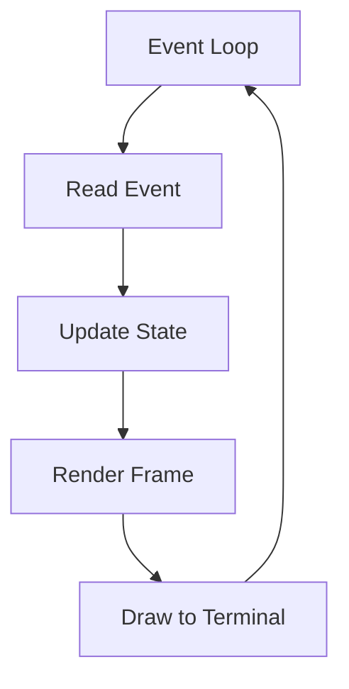
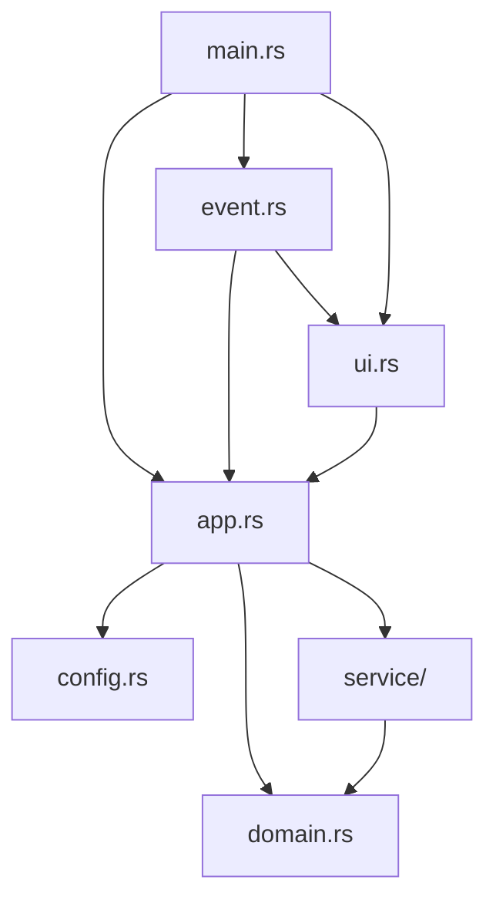

# 🦀 Learn Rust by Building Lazy-Dispatchrr

> A comprehensive, project-based Rust curriculum that takes you from zero to building a professional TUI application for dispatching GitHub Actions workflows.

---

## 📚 Course Overview

This curriculum teaches Rust through building **Lazy-Dispatchrr**, a terminal user interface (TUI) application that dispatches GitHub Actions workflows. By the end, you'll have built a real-world application featuring:

- 🎯 Terminal UI with keyboard navigation
- 🔍 Fuzzy search filtering
- 💾 YAML configuration persistence
- 🌐 GitHub CLI/API integration
- 📦 Modular architecture with clean separation of concerns

### Prerequisites

- Basic programming knowledge (any language)
- Command line familiarity
- [GitHub CLI (`gh`)](https://cli.github.com/) installed and authenticated
- [Rust toolchain](https://rustup.rs/) installed

### Time Estimate

| Module | Duration |
|--------|----------|
| Module 1: Foundations | 3-4 hours |
| Module 2: Data Modeling | 2-3 hours |
| Module 3: Configuration | 2-3 hours |
| Module 4: External Commands | 3-4 hours |
| Module 5: Terminal UI | 4-5 hours |
| Module 6: Event Handling | 3-4 hours |
| Module 7: Integration | 2-3 hours |
| **Total** | **~20-25 hours** |

---

## 🗺️ Module 1: Rust Foundations & Project Setup

### Learning Objectives

- Understand Cargo and Rust project structure
- Learn modules, visibility, and the `use` keyword
- Understand `Result<T, E>` error handling
- Write your first Rust function with error propagation

### 1.1 Project Initialization

```bash
cargo new lazy-dispatchr
cd lazy-dispatchr
```

#### 📖 Concepts Introduced

| Concept | Description | Reference File |
|---------|-------------|----------------|
| `Cargo.toml` | Project manifest with dependencies | [Cargo.toml](file:///Users/prometheus/cloud_workspace/workspace/lazy-dispatchr-rs/Cargo.toml) |
| `edition` | Rust edition (2024) | Line 4 |
| `[dependencies]` | External crates | Lines 13-22 |

### 1.2 Module System

Study how the project organizes code into modules:

```rust
// main.rs - Entry point
mod app;        // Private module
mod event;      // Private module
mod ui;         // Private module
pub mod config; // Public module (accessible to other crates)
pub mod domain; // Public module
pub mod service; // Public module
```

#### 📝 Exercise 1.1: Module Visibility

1. Why are some modules `pub` and others not?
2. Create a new module `utils` and make a function callable from `main.rs`

### 1.3 The `?` Operator and Result Type

```rust
fn main() -> Result<()> {
    color_eyre::install()?;  // ? propagates errors upward
    let terminal = ratatui::init();
    enable_raw_mode()?;
    // ...
}
```

#### 📖 Key Concepts

- `Result<T, E>` - Either `Ok(T)` or `Err(E)`
- `?` operator - Early return on error, unwrap on success
- `color_eyre` - Rich error reporting with backtraces

### 1.4 References

| File | Lines | What to Study |
|------|-------|---------------|
| [main.rs](file:///Users/prometheus/cloud_workspace/workspace/lazy-dispatchr-rs/src/main.rs) | 1-31 | Entry point, module declarations, error handling |

---

## 🏗️ Module 2: Data Modeling with Structs and Enums

### Learning Objectives

- Define `struct`s with various field types
- Add behavior with `impl` blocks
- Use derive macros (`Debug`, `Default`, `Clone`)
- Model state with enums

### 2.1 Domain Structs

Study the core data structures:

```rust
// domain.rs
#[derive(Debug, Default)]
pub struct Repo {
    pub name: String,
    pub branches: Vec<String>,
    pub workflows: Vec<String>,
}

#[derive(Debug, Clone)]
pub struct InputField {
    pub name: String,
    pub description: String,
    pub input_type: String,
    pub required: bool,
    pub default_value: String,
    pub options: Vec<String>,
    pub value: String,
}
```

#### 📖 Derive Macros Explained

| Macro | Purpose | When to Use |
|-------|---------|-------------|
| `Debug` | Enables `{:?}` formatting | Always add for development |
| `Default` | Provides default values | When you need `Struct::default()` |
| `Clone` | Enables `.clone()` method | When you need to duplicate data |
| `Copy` | Implicit cloning for small types | For simple types like numbers |

### 2.2 Enums for State

```rust
// app.rs
#[derive(Debug, Default, Clone, Copy, PartialEq)]
pub enum Focus {
    #[default]
    Repo,
    Branches,
    Workflows,
    Inputs,
    Output,
}
```

#### 📝 Exercise 2.1: Add a New Input Type

1. Add a new variant `Environment` to support environment variable inputs
2. Handle this variant in the input rendering logic

### 2.3 Struct Composition

The `AppState` uses composition to group related data:

```rust
pub struct AppState {
    pub data: AppData,  // Contains repos, branches, workflows, etc.
    pub ui: UiState,    // Contains list states, focus, popups, etc.
}
```

### 2.4 References

| File | Lines | What to Study |
|------|-------|---------------|
| [domain.rs](file:///Users/prometheus/cloud_workspace/workspace/lazy-dispatchr-rs/src/domain.rs) | 1-27 | Core data models |
| [app.rs](file:///Users/prometheus/cloud_workspace/workspace/lazy-dispatchr-rs/src/app.rs#L1-90) | 1-90 | State structs and enums |

---

## 💾 Module 3: Configuration & Serialization

### Learning Objectives

- Use Serde for YAML serialization/deserialization
- Work with the filesystem (`std::fs`, `std::path`)
- Handle optional fields with `#[serde(default)]`
- Use conditional compilation with `cfg!`

### 3.1 Serde Derive Macros

```rust
#[derive(serde::Serialize, serde::Deserialize, Debug, Default)]
pub struct Config {
    #[serde(default)]  // Use Default if missing in YAML
    pub repos: Vec<RepoConfig>,
}
```

#### 📖 Serialization Concepts

| Attribute | Purpose |
|-----------|---------|
| `Serialize` | Convert struct → YAML/JSON |
| `Deserialize` | Convert YAML/JSON → struct |
| `#[serde(default)]` | Use `Default::default()` if field missing |
| `#[serde(rename = "...")]` | Map to different field name |

### 3.2 Cross-Platform File Paths

```rust
fn config_path() -> PathBuf {
    let base = if cfg!(windows) {
        std::env::var("LOCALAPPDATA")
            .map(PathBuf::from)
            .unwrap_or_else(|_| dirs::config_dir().unwrap_or_else(|| PathBuf::from(".")))
    } else {
        std::env::var("XDG_CONFIG_HOME")
            .map(PathBuf::from)
            .unwrap_or_else(|_| {
                dirs::home_dir()
                    .unwrap_or_else(|| PathBuf::from("~"))
                    .join(".config")
            })
    };
    base.join("dispatchrr").join("config.yml")
}
```

#### 📖 Key Concepts

- `cfg!(windows)` - Compile-time OS detection
- `PathBuf` - Owned, mutable path type
- `Path::join()` - Platform-aware path concatenation
- `unwrap_or_else` - Provide fallback on `None`/`Err`

### 3.3 File I/O with Error Handling

```rust
pub fn load_config() -> Config {
    let path = config_path();
    if path.exists() {
        let contents = std::fs::read_to_string(&path).unwrap_or_default();
        serde_yaml::from_str(&contents).unwrap_or_default()
    } else {
        Config::default()
    }
}

pub fn save_config(config: &Config) -> Result<(), Box<dyn std::error::Error>> {
    let path = config_path();
    if let Some(parent) = path.parent() {
        std::fs::create_dir_all(parent)?;  // Create directories if needed
    }
    let yaml = serde_yaml::to_string(config)?;
    std::fs::write(&path, yaml)?;
    Ok(())
}
```

#### 📝 Exercise 3.1: Add a Settings Field

1. Add a `settings: Settings` field to `Config`
2. Include a `theme: String` option
3. Make it optional with `#[serde(default)]`

### 3.4 References

| File | Lines | What to Study |
|------|-------|---------------|
| [config.rs](file:///Users/prometheus/cloud_workspace/workspace/lazy-dispatchr-rs/src/config.rs) | 1-68 | Full configuration module |

---

## 🔧 Module 4: External Commands & Process Execution

### Learning Objectives

- Execute external commands with `std::process::Command`
- Parse JSON responses with `serde_json`
- Handle command output and errors
- Decode base64 content

### 4.1 Running External Commands

```rust
let output = std::process::Command::new("gh")
    .args(["api", "graphql", "-f", &format!("query={}", query)])
    .output()?;

if !output.status.success() {
    let stderr = String::from_utf8_lossy(&output.stderr);
    return Err(format!("gh cli error: {}", stderr.trim()).into());
}
```

#### 📖 Command Builder Pattern

| Method | Purpose |
|--------|---------|
| `::new("cmd")` | Create command builder |
| `.args([...])` | Add arguments as slice |
| `.arg("single")` | Add single argument |
| `.output()` | Execute and capture output |
| `.spawn()` | Start process without waiting |

### 4.2 JSON Parsing

```rust
let json: serde_json::Value = serde_json::from_slice(&output.stdout)?;
let repository = &json["data"]["repository"];

// Extract array of strings
let branches: Vec<String> = repository["refs"]["nodes"]
    .as_array()
    .map(|nodes| {
        nodes
            .iter()
            .filter_map(|n| n["name"].as_str().map(String::from))
            .collect()
    })
    .unwrap_or_default();
```

#### 📖 serde_json::Value Methods

| Method | Returns | Purpose |
|--------|---------|---------|
| `.as_str()` | `Option<&str>` | Access string value |
| `.as_u64()` | `Option<u64>` | Access number value |
| `.as_bool()` | `Option<bool>` | Access boolean value |
| `.as_array()` | `Option<&Vec<Value>>` | Access array |
| `.as_object()` | `Option<&Map>` | Access object |

### 4.3 Iterator Chains

```rust
// Parse YAML options into Vec<String>
let options: Vec<String> = val["options"]
    .as_sequence()
    .map(|opts| {
        opts.iter()
            .filter_map(|o| o.as_str().map(String::from))
            .collect()
    })
    .unwrap_or_default();
```

#### 📖 Iterator Methods Deep Dive

| Method | Purpose |
|--------|---------|
| `.iter()` | Create iterator over references |
| `.filter_map(f)` | Filter + map in one pass (removes `None`s) |
| `.map(f)` | Transform each element |
| `.collect()` | Gather into collection |
| `.join(", ")` | Combine strings with separator |

### 4.4 References

| File | Lines | What to Study |
|------|-------|---------------|
| [github.rs](file:///Users/prometheus/cloud_workspace/workspace/lazy-dispatchr-rs/src/service/github.rs) | 1-254 | Full GitHub service |
| [github.rs](file:///Users/prometheus/cloud_workspace/workspace/lazy-dispatchr-rs/src/service/github.rs#L12-84) | 12-84 | GraphQL API call |
| [github.rs](file:///Users/prometheus/cloud_workspace/workspace/lazy-dispatchr-rs/src/service/github.rs#L86-170) | 86-170 | YAML parsing |

---

## 🎨 Module 5: Terminal UI with Ratatui

### Learning Objectives

- Understand immediate-mode UI rendering
- Create layouts with Ratatui constraints
- Build widgets: `List`, `Paragraph`, `Block`
- Style text with colors and modifiers
- Create popup overlays

### 5.1 Ratatui Architecture



### 5.2 Layout Constraints

```rust
let main_layout = Layout::default()
    .direction(Direction::Horizontal)
    .constraints([
        Constraint::Percentage(30),  // Left panels
        Constraint::Percentage(70),  // Right output
    ])
    .split(frame.area());
```

#### 📖 Constraint Types

| Type | Usage |
|------|-------|
| `Percentage(n)` | Takes n% of available space |
| `Length(n)` | Exactly n cells |
| `Min(n)` | At least n cells |
| `Max(n)` | At most n cells |
| `Ratio(a, b)` | Takes a/b of space |

### 5.3 Building Widgets

```rust
// Create a selectable list
let repos: Vec<ListItem> = state.data.repos
    .iter()
    .map(|r| ListItem::new(r.name.clone()))
    .collect();

let repos_list = List::new(repos)
    .block(Block::default()
        .borders(Borders::ALL)
        .title(" Repositories ")
        .border_style(if is_focused { 
            Style::default().fg(Color::Yellow) 
        } else { 
            Style::default() 
        }))
    .highlight_style(Style::default()
        .fg(Color::Black)
        .bg(Color::Yellow));

frame.render_stateful_widget(repos_list, area, &mut state.ui.repos_state);
```

#### 📖 Widget Rendering

| Method | Purpose |
|--------|---------|
| `render_widget(widget, area)` | Render stateless widget |
| `render_stateful_widget(widget, area, state)` | Render with selection state |

### 5.4 Creating Popup Overlays

```rust
// Centered popup (40% x 30%)
fn centered_rect(percent_x: u16, percent_y: u16, area: Rect) -> Rect {
    let popup_layout = Layout::default()
        .direction(Direction::Vertical)
        .constraints([
            Constraint::Percentage((100 - percent_y) / 2),
            Constraint::Percentage(percent_y),
            Constraint::Percentage((100 - percent_y) / 2),
        ])
        .split(area);

    Layout::default()
        .direction(Direction::Horizontal)
        .constraints([
            Constraint::Percentage((100 - percent_x) / 2),
            Constraint::Percentage(percent_x),
            Constraint::Percentage((100 - percent_x) / 2),
        ])
        .split(popup_layout[1])[1]
}

// Clear background and render popup
frame.render_widget(Clear, popup_area);
frame.render_widget(popup_widget, popup_area);
```

### 5.5 References

| File | Lines | What to Study |
|------|-------|---------------|
| [ui.rs](file:///Users/prometheus/cloud_workspace/workspace/lazy-dispatchr-rs/src/ui.rs) | 1-523 | Full UI rendering |

---

## ⌨️ Module 6: Event Handling & State Machines

### Learning Objectives

- Handle keyboard events with crossterm
- Implement state machine patterns with enums
- Navigate complex conditional logic
- Work with mutable references (`&mut`)

### 6.1 Event Loop Structure

```rust
pub fn run(mut terminal: DefaultTerminal, state: &mut AppState) -> Result<()> {
    loop {
        terminal.draw(|frame| render(frame, state))?;
        
        if event::poll(std::time::Duration::from_millis(100))? {
            if let Event::Key(key) = event::read()? {
                match key.code {
                    KeyCode::Char('q') => return Ok(()),
                    KeyCode::Char('j') | KeyCode::Down => handle_down(state),
                    KeyCode::Enter => handle_enter(state)?,
                    // ... more handlers
                    _ => {}
                }
            }
        }
    }
}
```

### 6.2 Pattern Matching on State

```rust
match state.ui.focus {
    Focus::Repo => {
        match key.code {
            KeyCode::Enter => {
                state.load_branches()?;
                state.ui.focus = Focus::Branches;
            }
            _ => {}
        }
    }
    Focus::Branches => {
        // Different behavior for same key
    }
    // ...
}
```

### 6.3 List State Navigation

```rust
fn select_next(state: &mut ratatui::widgets::ListState, len: usize) {
    let i = match state.selected() {
        Some(i) => {
            if i >= len.saturating_sub(1) {
                0  // Wrap to beginning
            } else {
                i + 1
            }
        }
        None => 0,
    };
    state.select(Some(i));
}
```

#### 📖 Key Concepts

- `saturating_sub` - Subtraction that stops at 0
- `Option::Some/None` pattern matching
- `ListState` - Tracks selection in lists

### 6.4 Fuzzy Search Implementation

```rust
use fuzzy_matcher::skim::SkimMatcherV2;
use fuzzy_matcher::FuzzyMatcher;

fn update_search_filter(&mut self) {
    let matcher = SkimMatcherV2::default();
    let query = &self.ui.search_query;
    
    self.ui.filtered_repos = self.data.repos
        .iter()
        .enumerate()
        .filter(|(_, r)| {
            query.is_empty() || matcher.fuzzy_match(&r.name, query).is_some()
        })
        .map(|(i, _)| i)
        .collect();
}
```

### 6.5 References

| File | Lines | What to Study |
|------|-------|---------------|
| [event.rs](file:///Users/prometheus/cloud_workspace/workspace/lazy-dispatchr-rs/src/event.rs) | 1-509 | Full event handling |
| [event.rs](file:///Users/prometheus/cloud_workspace/workspace/lazy-dispatchr-rs/src/event.rs#L9-50) | 9-50 | Main event loop |
| [app.rs](file:///Users/prometheus/cloud_workspace/workspace/lazy-dispatchr-rs/src/app.rs#L191-263) | 191-263 | Fuzzy filtering |

---

## 🔗 Module 7: Integration & Architecture

### Learning Objectives

- Design clean module boundaries
- Use trait `Box<dyn Error>` for error handling
- Implement the builder pattern
- Understand ownership across function boundaries

### 7.1 Module Dependency Graph



### 7.2 Error Handling Strategy

```rust
// Use Box<dyn Error> for flexibility
pub fn run_workflow(&mut self) -> Result<(), Box<dyn std::error::Error>> {
    let repo_name = self.current_repo_name()?;      // Propagate
    let branch = self.current_branch()?;            // Propagate
    let workflow = self.current_workflow_file()?;   // Propagate
    
    let (_, preview) = self.service.dispatch_workflow(
        &repo_name, &branch, &workflow, &self.data.inputs
    )?;  // Propagate external command errors
    
    self.ui.dispatch_output = vec![format!("✅ Workflow dispatched!")];
    Ok(())
}

// Helper that returns custom error
fn current_repo_name(&self) -> Result<String, Box<dyn std::error::Error>> {
    self.selected_repo_real_index()
        .map(|i| self.data.repos[i].name.clone())
        .ok_or_else(|| "No repo selected".into())
}
```

### 7.3 State Immutability Patterns

```rust
// Read-only access (no mutation)
pub fn build_dispatch_command(&self) -> Result<(Vec<String>, String), ...> {
    let repo_name = self.current_repo_name()?;  // Only reads
    // ...
}

// Mutable access (modifies state)
pub fn run_workflow(&mut self) -> Result<(), ...> {
    self.ui.dispatch_output = vec![...];  // Mutates state
    // ...
}
```

### 7.4 Final Project Structure

```
lazy-dispatchr-rs/
├── Cargo.toml              # Dependencies & metadata
├── src/
│   ├── main.rs            # Entry point, terminal setup
│   ├── app.rs             # State management, business logic
│   ├── event.rs           # Keyboard event handling
│   ├── ui.rs              # TUI rendering
│   ├── config.rs          # YAML persistence
│   ├── domain.rs          # Core data structures
│   └── service/
│       ├── mod.rs         # Module declaration
│       └── github.rs      # GitHub CLI integration
```

---

## 🎯 Capstone Exercises

### Exercise 1: Add Dark/Light Theme Toggle

1. Add a `Theme` enum with `Dark` and `Light` variants
2. Store theme preference in `config.yml`
3. Add a keybinding (`t`) to toggle themes
4. Update all `Style::default().fg()` calls to use theme colors

### Exercise 2: Implement Workflow Run History

1. Create a `RunHistory` struct tracking past dispatches
2. Add a new panel or popup to display history
3. Allow re-running a historical dispatch
4. Persist history to config file

### Exercise 3: Add Async Loading Indicators

1. Research the `tokio` or `async-std` crates
2. Make GitHub API calls async
3. Show a loading spinner while fetching data
4. Handle cancellation if user presses `Esc`

### Exercise 4: Write Unit Tests

1. Add tests for fuzzy filtering logic
2. Mock GitHub CLI responses for testing
3. Test configuration save/load roundtrip
4. Add integration test for full workflow

---

## 📋 Rust Concepts Quick Reference

| Concept | Where Used | Module |
|---------|------------|--------|
| Modules (`mod`, `pub mod`) | main.rs | 1 |
| `Result<T, E>` | Throughout | 1 |
| `?` operator | Throughout | 1 |
| `struct` | domain.rs, app.rs | 2 |
| `enum` | app.rs (Focus) | 2 |
| `impl` blocks | app.rs, github.rs | 2 |
| `#[derive(...)]` | All data types | 2 |
| Serde serialization | config.rs | 3 |
| `PathBuf` | config.rs | 3 |
| `cfg!` macro | config.rs | 3 |
| `std::process::Command` | github.rs | 4 |
| JSON parsing | github.rs | 4 |
| Iterators | Throughout | 4 |
| `Vec<T>` | Throughout | 2-4 |
| `Option<T>` | Throughout | 2-4 |
| References (`&`, `&mut`) | Throughout | 6 |
| Pattern matching | event.rs | 6 |
| `Box<dyn Error>` | Service layer | 7 |

---

## 🔗 Additional Resources

- [The Rust Book](https://doc.rust-lang.org/book/) - Official guide
- [Ratatui Documentation](https://ratatui.rs/) - TUI framework
- [Serde Guide](https://serde.rs/) - Serialization
- [Crossterm Docs](https://docs.rs/crossterm/) - Terminal I/O
- [Error Handling in Rust](https://blog.burntsushi.net/rust-error-handling/) - Deep dive

---

> **Happy Learning!** 🦀 Build this project step by step, and you'll gain practical Rust skills applicable to many domains.
